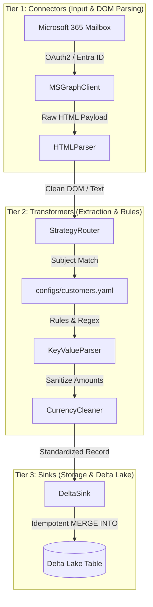
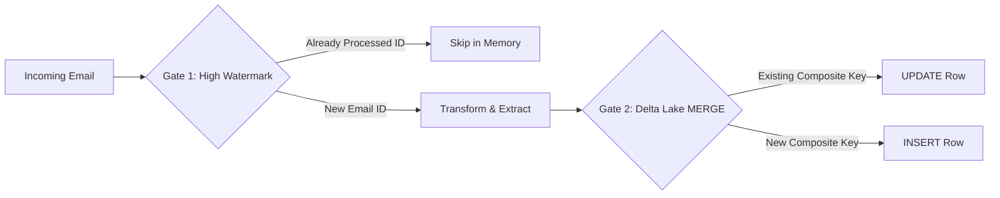

# 📖 mail2delta: Architecture & Operational Guide

An enterprise-grade, deterministic email ingestion and financial reconciliation framework that streams unstructured AR payment advice emails from **Microsoft 365 (MS Graph API)** directly into **Databricks Delta Lake**.

---

## 🏗️ 1. Decoupled 3-Tier Architecture

The framework enforces **Strict Domain Isolation** across three independent layers:



### 🚪 Tier 1: Connectors (`src/connectors/`) — "The Hands"
* **`ms_graph_client.py`**: Handles OAuth2 Entra ID Client Credentials authentication, automatic access token caching and expiration renewal, and paginated OData message queries.
* **`html_parser.py`**: Converts raw HTML email bodies into clean, normalized multi-line text and extracts structured HTML `<table>` elements into pandas DataFrames.
* 🛡️ *Isolation Rule:* Connectors have **zero knowledge** of customer names, billing codes, or database tables.

### ⚙️ Tier 2: Transformers (`src/transformers/`) — "The Brain"
* **`strategy_router.py`**: Matches incoming email subjects against declarative regex rules in `configs/customers.yaml` and routes each email to the appropriate parser strategy.
* **`key_value_parser.py`**: Extracts billing codes and payment amounts from key-value rows and tables, supporting custom code prefixes (e.g. `79` for Imoto).
* **`currency_cleaner.py`**: Sanitizes international currencies (`¥`, `￥`, `$`, `€`, `£`), full-width characters, and accounting negative notations (`▲`, `△`, `( )`, `-`) into standard Python `float`s. Rejects invalid non-currency labels to eliminate false positives.
* 🛡️ *Isolation Rule:* Transformers have **zero knowledge** of network protocols, REST APIs, or Spark SQL.

### 💾 Tier 3: Sinks (`src/sinks/`) — "The Vault"
* **`delta_sink.py`**: Converts extracted Python records into Spark DataFrames and generates dynamic `MERGE INTO` SQL queries keyed on business composite keys (`customer_code` + `payment_due_label`).
* 🛡️ *Isolation Rule:* Sinks have **zero knowledge** of email formats or customer regex patterns.

---

## 🛡️ 2. The Two-Gate Deduplication System

To guarantee 100% idempotency with zero duplicate rows in Delta Lake:



| Gate | Execution Layer | Mechanism | Purpose & Benefit |
| :--- | :--- | :--- | :--- |
| **Gate 1** | **Driver / Network** | `MAX(email_received_at) - 7 days` safety buffer. Loads recent `email_unique_id`s and filters out known messages in memory. | Drastically reduces redundant parsing compute and Graph API calls. |
| **Gate 2** | **Delta Lake Storage** | Dynamic `MERGE INTO` SQL on composite keys (`customer_code` + `payment_due_label`). | Guarantees idempotency. If a customer sends a revised email, it automatically **updates** the existing row instead of duplicating it. |

---

## ⚙️ 3. Zero-Code Customer Onboarding (`configs/customers.yaml`)

To onboard a new customer, add an entry to `configs/customers.yaml` without writing any Python code:

```yaml
customers:
  NewCustomer:
    subject_regex: "NewCustomer|新規顧客"
    strategy: "key_value_table"
    merge_keys:
      - "customer_code"
      - "payment_due_label"
    params:
      customer_name: "NewCustomer"
      code_regex: "請求先コード|Vendor Code"
      amount_regex: "当月入金額|振込額|支払額"
      prefix_code: "79"            # Optional: auto-prefixes short codes
      currency: "JPY"
      default_label: "支払額"
```

---

## 🧪 4. Testing & Verification Guide

### 🚀 Databricks Interactive Test Utility
In any Databricks notebook cell, run this test snippet to inspect extraction on live incoming emails:

```python
import os
import sys

# Add project src to path
sys.path.append(os.path.abspath("src"))

from connectors.ms_graph_client import MSGraphClient
from transformers.strategy_router import StrategyRouter

# 1. Credentials
tenant_id = os.getenv("AZURE_TENANT_ID") or dbutils.secrets.get(scope="finops_m365", key="azure_tenant_id")
client_id = os.getenv("AZURE_CLIENT_ID") or dbutils.secrets.get(scope="finops_m365", key="azure_client_id")
client_secret = os.getenv("AZURE_CLIENT_SECRET") or dbutils.secrets.get(scope="finops_m365", key="azure_client_secret")
mailbox = os.getenv("MAILBOX_ADDRESS", "your_inbox@yourdomain.com")

# 2. Router & Client
router = StrategyRouter("configs/customers.yaml")
client = MSGraphClient(tenant_id, client_id, client_secret, mailbox)

# 3. Fetch & Verify
latest_emails = client.fetch_messages(top=15)
for email in latest_emails:
    subject = email.get("subject", "No Subject")
    print(f"\n📧 Checking: {subject}")
    record, merge_keys = router.process_email(email)
    if record:
        print("✅ EXTRACTED SUCCESSFULLY:")
        for k, v in record.items():
            print(f"   {k}: {v}")
        print(f"   🔑 Merge Keys: {merge_keys}")
    else:
        print("   ⚠️ Skipped: Non-customer or non-matching email.")
```

---

## 📊 5. Verified Customer Reference Matrix

All 9 customer formats have been tested and verified end-to-end:

| # | Customer | Code Pattern | Amount Pattern | Sample Expected Amount | Special Feature Tested |
| :---: | :--- | :--- | :--- | :--- | :--- |
| **1** | **KamoShoji** (加茂商事) | `請求先コード: 7910890000` | `3/31 支払額: ¥180,123,447` | `180123447.0` | Table DOM row extraction |
| **2** | **Chiyoda** (チヨダ) | `請求先コード: 7920150000` | `当月振込額: ¥115,430,200` | `115430200.0` | Negative offset handling (`▲¥5,069,800`) |
| **3** | **GFoot** (ジーフット) | `請求先コード: 7930450000` | `・当月入金額: ¥80,000,000` | `80000000.0` | Greeting phrase isolation |
| **4** | **ABCMart** (ABC-MART) | `請求先コード: 7940880000` | `・当月お支払額: ¥337,500,000` | `337500000.0` | Key-value table mapping |
| **5** | **Mega** (AEON Sports) | `請求先コード: 7950920000` | `・振込金額: ¥62,150,000` | `62150000.0` | Multiple variant amount regex |
| **6** | **Himaraya** (ヒマラヤ) | `請求先コード: 7960110000` | `・当月お支払額: ¥141,250,000` | `141250000.0` | Standard billing advice layout |
| **7** | **Amazon** (Amazon Japan) | `Vendor Code: 7970330000` | `・Net Payment: ¥265,000,000` | `265000000.0` | English & Japanese bilingual advice |
| **8** | **Imoto** (イモト) | `コード: 1089555` | `・当月支払額: ¥68,500,000` | `68500000.0` | **Auto-prefix `79` rule** (`791089555`) |
| **9** | **Xebio** (ゼビオ) | `請求先コード: 7980550000` | `・当月お支払額: ¥191,600,000` | `191600000.0` | Accounting reconciliation layout |
| 🛡️ | **System Emails** | N/A | N/A | *Skipped* | Zero false-positives on invoices/alerts |

---

## 🚀 6. Production Databricks Orchestration

Run [`notebooks/finance_ops_collections.py`](file:///Users/mrrobot/Desktop/Projects/email-ingestion-framework/notebooks/finance_ops_collections.py) as a scheduled Databricks Job:

```bash
# Automated run in Databricks workflow
run_pipeline(spark)
```
