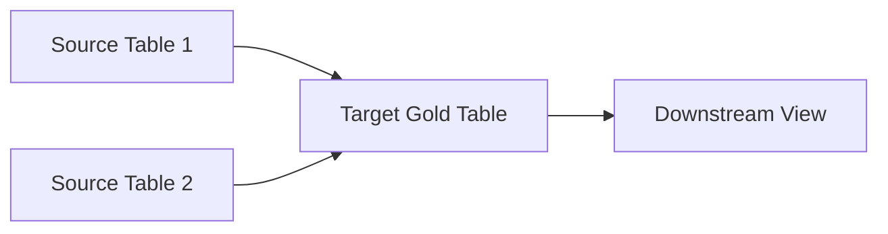

# {Data Product Name} Documentation

**Created by**: mindwanders1993 | **Last updated on**: [Date]

## 🛡️ Stewardship Hero Card
* **Data Owner**: [Owner/Team]
* **Freshness (SLA)**: [e.g., Daily 6:30 AM JST]
* **Grain**: [e.g., 1 row per Article per Season]
* **Sensitivity**: [e.g., High / Contains PII / Internal Only]

---

[ **Background** ] | [ **Entity Relationship Diagram (ERD)** ] | [ **Databricks** ] | [ **Power BI** ] | [ **ETLs** ] | [ **FAQ** ] | [ **Resources** ]

## Background
[Provide a brief overview of key sources and the business purpose of this dataset.]

* Source 1
* Source 2

*NB: [Any specific notes or warnings about data inconsistency or prefix usage]*

---

## Entity Relationship Diagram (ERD)

---

## Databricks

| name | code | description | granularity | refresh schedule |
| :--- | :--- | :--- | :--- | :--- |
| [table_name] | [code_link] | [uc_comment] | [pk_columns] | [job_schedule] |

---

## Power BI

| name | source |
| :--- | :--- |
| [Report Name] | [Target View/Table] |

---

## ETLs

| source | schema | layer | name | DDL | code | job | schedule |
| :--- | :--- | :--- | :--- | :--- | :--- | :--- | :--- |
| [System] | [Schema Name] | [gold/silver/bronze] | [Table Name] | [sql_file_link] | [notebook_link] | [job_name_link] | [cron_schedule] |

---

## FAQ

**[Question 1?]**
[Answer]

---

## Resources

* [Link 1]
