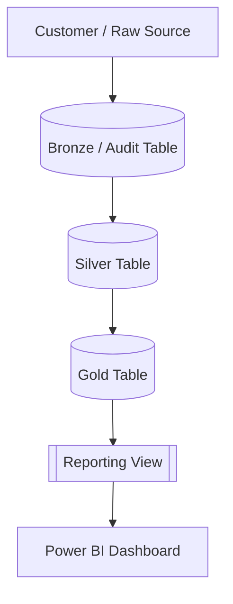

# 📦 [Data Pipeline Name] 

**Stewardship**: [Owner Name] | **SLA**: [e.g., Daily 8:00 AM] | **Sensitivity**: [Internal / PII]

## 📝 Overview
[Describe the overall business purpose of this pipeline. E.g., This data pipeline processes daily Wholesale Sellout files from customers, cleans them into Silver, aggregates for the Japan market in Gold, and serves Power BI.]

---

## 🕸️ Pipeline Architecture (Lineage)



---

## 🗄️ Table Catalog
*The core tables that make up this data product:*

| Layer | Table Name | Purpose & Grain |
| :--- | :--- | :--- |
| **Audit/Bronze** | `[table_1]` | [Tracks file arrival and pipeline success.] |
| **Silver** | `[table_2]` | [Cleansed, granular data.] |
| **Gold** | `[table_3]` | [Aggregated metrics.] |
| **View** | `[table_4]` | [Semantic layer for BI.] |

---

## 🛠️ Operations & Data Quality
*Queries to check the health of this pipeline:*

**1. Check for Pipeline Failures:**
```sql
-- Insert a sample query to check the audit log for failures
```

**2. Data Quality Notes:**
* [Note from profiling, e.g., column X is 80% null]

---

## 📊 Downstream Consumers
* **Dashboard**: [Link to Power BI or downstream system]
